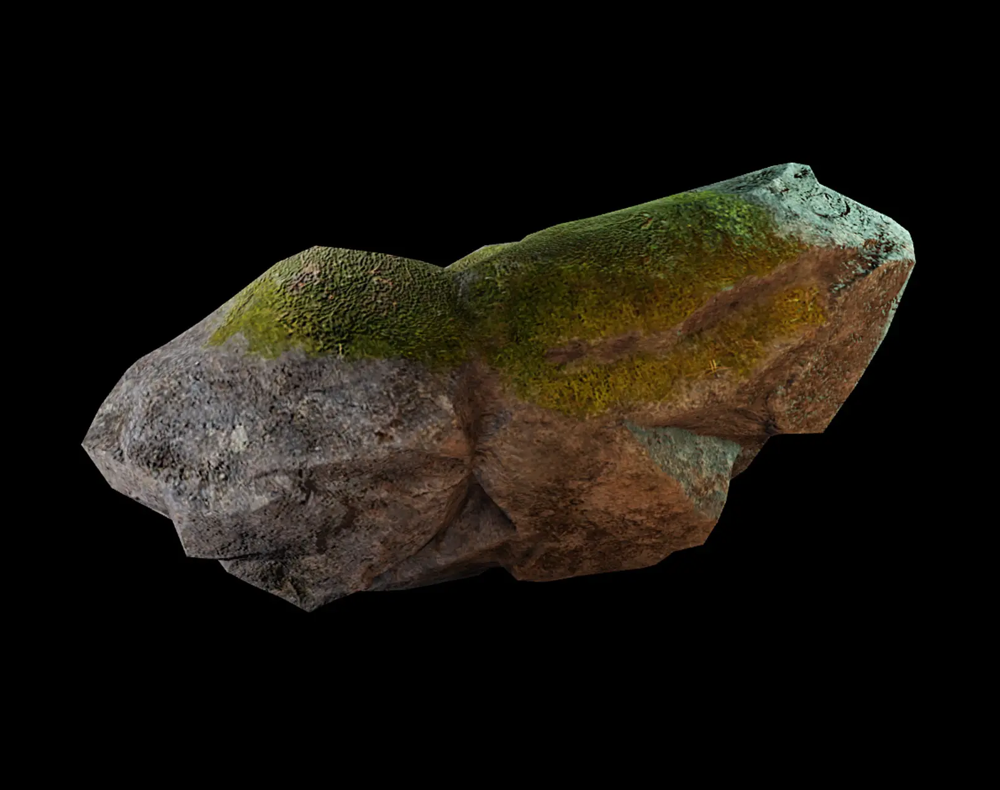

# PBR Material Renderer

A lightweight PBR material renderer engine built with Vulkan and SDL2.

<p align="left" width="100%">
     
     
</p>

## Getting Started

### Development Environment

You can use the provided `flake.nix` to create a Nix environment.
```bash
nix develop
```
This will set up everything needed to start working on the project.

### Build Instructions

Generate the build files with `cmake`.
```bash
cmake -B build
```

Then build the project.
```bash
cmake --build build
```

Finally, run the project.
```bash
./build/main
```

### Debug

You can also specify the build type `Debug` to enable debug symbols and sanitizers.
```bash
cmake -DCMAKE_BUILD_TYPE=Debug -B build
```
